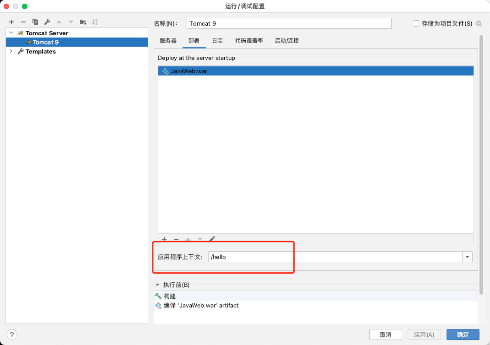
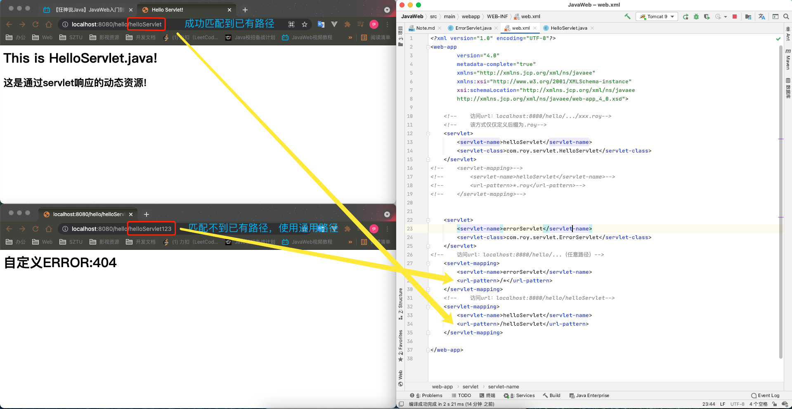
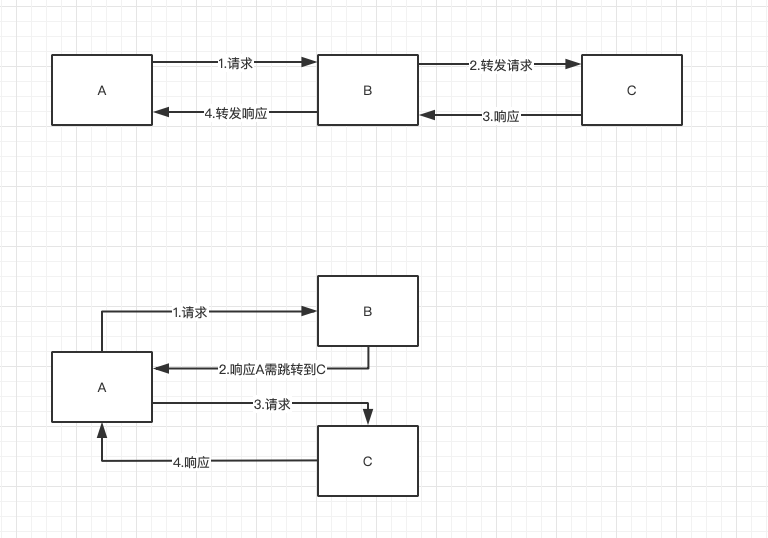
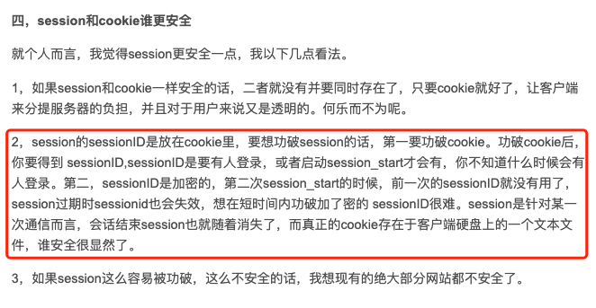

## servlet理解
> servlet是一个服务连接器，一般用于连接Tomcat（Tomcat是一个webServer服务器，动态响应请求） 

#### 流程：
1. 编写一个controller层的业务类
    1. 继承HttpServlet类（本质上是实现Servlet接口，Java公司提供实现类，我们直接使用）
        1. 重写doGet或doPost方法（具体选择根据Get请求或POST请求进行区分）
    2. 需返回html动态内容
    ```java
    public class HelloServlet extends HttpServlet {
        @Override
        protected void doGet(HttpServletRequest req, HttpServletResponse resp) throws ServletException, IOException {
            resp.setContentType("text/html");
            resp.setCharacterEncoding("utf-8");
            PrintWriter out = resp.getWriter();
            out.println("<html>");
            out.println("<head>");
            out.println("<title>Hello Servlet!</title>");
            out.println("</head>");
            out.println("<body>");
            out.println("<h1>This is HelloServlet.java!</h1>");
            out.println("<h2>这是通过servlet响应的动态资源!</h2>");
            out.println("</body>");
            out.println("</html>");
        }
    
        @Override
        protected void doPost(HttpServletRequest req, HttpServletResponse resp) throws ServletException, IOException {
            doGet(req,resp);       //由于Get和Post只是请求方式不同，可以相互调用，业务逻辑一样
        }
    }
    ```
2. 在web.xml文件进行配置
    1. 配置一个servlet（我们把继承了Servlet类的Java程序叫做servlet ），规定名字并指向对应的业务类
        ```xml
               <servlet>
                   <servlet-name>helloServlet</servlet-name>
                   <servlet-class>com.roy.servlet.HelloServlet</servlet-class>
               </servlet> 
        ```
    2. 配置一个servlet-mapping（请求路径和servlet的映射关系）
        ```xml
               <servlet-mapping>
                    <servlet-name>helloServlet</servlet-name>
                    <url-pattern>/helloServlet</url-pattern>
                </servlet-mapping>
        ```

#### Mapping问题：
> 注意：基础路径为localhost:8080/hello      （hello为WebServer配置的项目根路径）


#### Servlet与请求路径的关系：
1. 一个Servlet可以指定**一个映射路径**
    ```xml
       <web-app
               version="4.0"
               metadata-complete="true"
               xmlns="http://xmlns.jcp.org/xml/ns/javaee"
               xmlns:xsi="http://www.w3.org/2001/XMLSchema-instance"
               xsi:schemaLocation="http://xmlns.jcp.org/xml/ns/javaee
               http://xmlns.jcp.org/xml/ns/javaee/web-app_4_0.xsd">
       
           <servlet>
               <servlet-name>helloServlet</servlet-name>
               <servlet-class>com.roy.servlet.HelloServlet</servlet-class>
           </servlet>
   
           <!--    访问url：localhost:8080/hello/helloServlet-->
           <servlet-mapping>
               <servlet-name>helloServlet</servlet-name>
               <url-pattern>/helloServlet</url-pattern>
           </servlet-mapping>
       
       </web-app> 
   ```
2. 一个Servlet可以指定**多个映射路径**
    ```xml
       <web-app version="4.0"
                        metadata-complete="true"
                        xmlns="http://xmlns.jcp.org/xml/ns/javaee"
                        xmlns:xsi="http://www.w3.org/2001/XMLSchema-instance"
                        xsi:schemaLocation="http://xmlns.jcp.org/xml/ns/javaee
                        http://xmlns.jcp.org/xml/ns/javaee/web-app_4_0.xsd">
           <servlet>
               <servlet-name>helloServlet</servlet-name>
               <servlet-class>com.roy.servlet.HelloServlet</servlet-class>
           </servlet>
           
           <!--    访问url：localhost:8080/hello/helloServlet_1或者localhost:8080/hello/helloServlet_2-->
           <!--    或者localhost:8080/hello/helloServlet_3或者localhost:8080/hello/helloServlet_4-->
           <servlet-mapping>
               <servlet-name>helloServlet</servlet-name>
               <url-pattern>/helloServlet_1</url-pattern>
           </servlet-mapping>
           <servlet-mapping>
               <servlet-name>helloServlet</servlet-name>
               <url-pattern>/helloServlet_2</url-pattern>
           </servlet-mapping>
           <servlet-mapping>
               <servlet-name>helloServlet</servlet-name>
               <url-pattern>/helloServlet_3</url-pattern>
           </servlet-mapping>
           <servlet-mapping>
               <servlet-name>helloServlet</servlet-name>
               <url-pattern>/helloServlet_4</url-pattern>
           </servlet-mapping>
       
       </web-app>
   ```
3. 一个Servlet可以指定**通用映射路径**
    ```xml
       <web-app
               version="4.0"
               metadata-complete="true"
               xmlns="http://xmlns.jcp.org/xml/ns/javaee"
               xmlns:xsi="http://www.w3.org/2001/XMLSchema-instance"
               xsi:schemaLocation="http://xmlns.jcp.org/xml/ns/javaee
               http://xmlns.jcp.org/xml/ns/javaee/web-app_4_0.xsd">
       
           <servlet>
               <servlet-name>helloServlet</servlet-name>
               <servlet-class>com.roy.servlet.HelloServlet</servlet-class>
           </servlet>
       
       <!--    访问url：localhost:8080/hello/helloServlet下的任何路径-->
       <!--    包括localhost:8080/hello/helloServlet以及localhost:8080/hello/helloServlet/1/1/1/之类的-->
           <servlet-mapping>
               <servlet-name>helloServlet</servlet-name>
               <url-pattern>/helloServlet/*</url-pattern>
           </servlet-mapping>
       
       </web-app>
   ```
4. 一个Servlet可以指定**自定义后缀映射路径**（注意：*前面不能加映射路径以及"/"）
    ```xml
       <web-app
               version="4.0"
               metadata-complete="true"
               xmlns="http://xmlns.jcp.org/xml/ns/javaee"
               xmlns:xsi="http://www.w3.org/2001/XMLSchema-instance"
               xsi:schemaLocation="http://xmlns.jcp.org/xml/ns/javaee
               http://xmlns.jcp.org/xml/ns/javaee/web-app_4_0.xsd">
       
           <servlet>
               <servlet-name>helloServlet</servlet-name>
               <servlet-class>com.roy.servlet.HelloServlet</servlet-class>
           </servlet>
       
       <!--    访问url：localhost:8080/hello/.../xxx.roy-->
       <!--    该方式仅仅定义后缀为.roy-->
           <servlet-mapping>
               <servlet-name>helloServlet</servlet-name>
               <url-pattern>*.roy</url-pattern>
           </servlet-mapping>
       
       </web-app> 
   ```
5. 请求路径**优先级**问题
> 指定了已有的映射路径优先级最高，如果找不到已有的映射路径则会走默认的通用映射路径


#### ServletContext（Servlet上下文）
1. 不同Servlet对象之间**共享数据**
    1. 写入ServletContext
        ```java
            public class ServletObjectOne extends HttpServlet {
                @Override
                protected void doGet(HttpServletRequest req, HttpServletResponse resp) throws ServletException, IOException {
                    resp.setCharacterEncoding("utf-8");
                    resp.setContentType("text/html");
                    ServletContext servletContext = this.getServletContext();
                    String name = "洛伊";     //数据
                    servletContext.setAttribute("username",name);   //将数据以键值对形式存入ServletContext中
                    PrintWriter out = resp.getWriter();
                    out.println("<h1>Servlet对象1往ServletContext写入的username为"+name+"</h1>");
                }
            
                @Override
                protected void doPost(HttpServletRequest req, HttpServletResponse resp) throws ServletException, IOException {
                    doGet(req, resp);
                }
            }
        ```
    2. 读取ServletContext
        ```java
           public class ServletObjectTwo extends HttpServlet {
               @Override
               protected void doGet(HttpServletRequest req, HttpServletResponse resp) throws ServletException, IOException {
                   resp.setCharacterEncoding("utf-8");
                   resp.setContentType("text/html");
                   ServletContext servletContext = this.getServletContext();
                   String username = (String) servletContext.getAttribute("username");
                   PrintWriter out = resp.getWriter();
                   out.println("<h1>Servlet对象2从ServletContext读取的username为"+username+"</h1>");
               }
           
               @Override
               protected void doPost(HttpServletRequest req, HttpServletResponse resp) throws ServletException, IOException {
                   doGet(req, resp);
               }
           }
        ```
2. 转发
    1. 代码实现
        ```java
           public class ServletObj03 extends HttpServlet {
               @Override
               protected void doGet(HttpServletRequest req, HttpServletResponse resp) throws ServletException, IOException {
                   ServletContext servletContext = this.getServletContext();
                   //转发请求/servletObj1路径的资源
                   servletContext.getRequestDispatcher("/servletObj1").forward(req,resp);
               }
           
               @Override
               protected void doPost(HttpServletRequest req, HttpServletResponse resp) throws ServletException, IOException {
                   doGet(req, resp);
               }
           }
       ```
    2. **_转发和重定向的区分_**
        
        > 转发是指A向B请求，但是B没有A需要的资源，便向C去请求获取响应内容，再将响应内容响应给A，期间**url是不变的**
        
        > 重定向是指A向B请求，但是B响应A应该去请求C，于是A再去请求C并获取C的响应，期间**url是由请求B的路径改为请求C的路径**
        >> 例如用户登录，登录成功后跳转到首页其实就是重定向的过程
     
#### HttpServletResponse
1. 常见应用：
    1. 向浏览器输出信息
    2. 下载文件
        1. 获取下载文件路径
        2. 获取下载文件名
        3. 设置浏览器使得其支持下载我们的文件
        4. 获取下载文件的输入流
        5. 创建缓冲区
        6. 获取OutputStream对象
        7. 将FileOutputStream流写入到buffer缓冲区
        8. 使用OutputStream将缓冲区中的数据输出到客户端
    3. 验证码功能
    4. 实现重定向
        ```java
            public class RedirectServlet extends HttpServlet {
                @Override
                protected void doGet(HttpServletRequest req, HttpServletResponse resp) throws ServletException, IOException {
                    //重定向需要指明完整路径，即localhost:8080后的路径
                    
                    //方式一：通过setHeader和setStatus直接编写响应头信息和状态码来实现
            //        resp.setHeader("Location","/hello/servletObj3");
            //        resp.setStatus(302);
                    //方式二：通过sendRedirect实现
                    resp.sendRedirect("/hello/servletObj3");
                }
            
                @Override
                protected void doPost(HttpServletRequest req, HttpServletResponse resp) throws ServletException, IOException {
                    doGet(req, resp);
                }
            }
        ```
       
#### HttpServletRequest  
1. 获取参数
    - getParameter：返回String，用于返回一个值的字段
    - getParameterValues：返回String[]，用于返回一个数组的字段，比如复选框
2. 请求转发
    - getRequestDispatcher
```java
    public class LoginServlet extends HttpServlet {
        @Override
        protected void doGet(HttpServletRequest req, HttpServletResponse resp) throws ServletException, IOException {
            //获取请求参数
            String username = req.getParameter("username");
            String password = req.getParameter("password");
            String[] hobbies = req.getParameterValues("hobbies");
            //打印信息
            System.out.println("username:"+username);
            System.out.println("password:"+password);
            System.out.println(Arrays.toString(hobbies));
            //转发请求
            req.getRequestDispatcher("/success.jsp").forward(req,resp);
        }
    
        @Override
        protected void doPost(HttpServletRequest req, HttpServletResponse resp) throws ServletException, IOException {
            doGet(req, resp);
        }
    }
```


## 解决资源导出失败的问题
解决方案：
在maven配置文件里配置如下信息
```xml
<build>
    <resources>
      <resource>
        <directory>src/main/resources</directory>
        <includes>
          <include>**/*.properties</include>
          <include>**/*.xml</include>
        </includes>
        <filtering>true</filtering>
      </resource>
      <resource>
        <directory>src/main/java</directory>
        <includes>
          <include>**/*.properties</include>
          <include>**/*.xml</include>
        </includes>
        <filtering>true</filtering>
      </resource>
    </resources>
  </build>
```


## Cookie和Session
> 情景分析：如何证明你是深技大学生？
>> 第一，要么你有深技大官方发放的录取通知书/学生证/毕业证；第二，要么深技大学籍档案里有登记你的信息；
>>> 两种方式都能证明你是深技大的学生，但仍有差别。第一种是通过学校给你一个"信件"来证明，如果别人拿着这个"信件"也能伪造成你的身份；
>>> 第二种是在学校的学籍档案里登记你的信息，这个信息是存在于学校的档案系统里，无法被别人拿去伪造。

理解几个概念：
- 会话：用户打开浏览器，点击很多超链接，访问多个web资源，然后关闭浏览器，这个过程称为会话
- 有状态会话：用户重新打开浏览器并且访问上次访问过的web资源，服务端知道客户端曾今来过，这个过程称为有状态会话
- 保存有状态会话的两种技术：
    - cookie：服务端给客户端的一个能够表明身份的"信件"，客户端下次访问服务端时带上该"信件"即可，不需要再处理手续之类的（这里的手续指的是登录）
    - session：服务端将你的信息登记到服务器上，下次你再访问服务端时由服务端来匹配你的信息

常见场景：网站登录后，下次不用再重新登录，可以直接访问（前提是没有清理浏览器的缓存和cookie，并且是在有效期内的访问）

#### cookie：
1. cookie的使用
    - cookie是一个键值对形式的格式
    - req.getCookies()：获取请求中的cookies
    - resp.addCookie：往响应中添加cookie
    - cookie.getName()：获取cookie的键
    - cookie.getValue()：获取cookie的值
    - cookie.setMaxAge：设置cookie的有效期
    ```java
        public class CookieDemo1 extends HttpServlet {
            @Override
            protected void doGet(HttpServletRequest req, HttpServletResponse resp) throws ServletException, IOException {
                req.setCharacterEncoding("utf-8");
                resp.setCharacterEncoding("utf-8");
                resp.setContentType("text/html");
                PrintWriter out = resp.getWriter();
                //获取请求的cookie数组
                Cookie[] cookies = req.getCookies();
                //检验网站cookie的标志位
                boolean cookieFlag = false;
                //判断该cookie是否存在，如果不存在则表示第一次（还包括cookie失效后）访问；否则为非第一次访问
                if(cookies!=null){
                    //判断cookie是否正确
                    for (Cookie c:cookies){
                        if(c.getName().equals("lastLoginDateTime")){    //取出键为键为lastLoginDateTime的cookie
                            cookieFlag = true;
                            long lastLoginDateTime = Long.parseLong(c.getValue());
                            Date date = new Date(lastLoginDateTime);
                            out.write("你上次访问网站的时间："+date.toLocaleString());
                        }
                    }
                    if(!cookieFlag){
                        out.write("这是你第一次访问本站，将为你生成cookie！");
                        //生成一个cookie，键为lastLoginDateTime（最近一次登录时间），值为一个字符串
                        Cookie cookie = new Cookie("lastLoginDateTime", System.currentTimeMillis() + "");
                        resp.addCookie(cookie);
                    }
                }else{  //因为网站默认会有已存在的一些cookie（比如打开浏览器会有的cookie之类）
                    out.write("OMG！竟然一个cookie都没有");
                }
            }
        
            @Override
            protected void doPost(HttpServletRequest req, HttpServletResponse resp) throws ServletException, IOException {
                doGet(req, resp);
            }
        }
    ```
2. cookie的存放
    一般会保存于本地的用户目录下
3. cookie的细节
    - 一个cookie只能保存一个信息
    - 一个web站点可以给浏览器发送多个cookies，但最多存放20个cookie
    - cookie的大小有限制，不超过4kb
    - 浏览器的cookie存放是有上限的，一般为300个
4. 删除cookie的方式
    1. 不设置cookie的有效期，关闭浏览器后cookie自动失效
    2. 设置cookie的有效期为0
5. 生成带有中文的cookie
```text
    //如果需要生成一个中文的cookie，最好先进行一个编码
    Cookie cookie = new Cookie("name", URLEncoder.encode("洛伊", "utf-8"));
    //取出来的时候需要进行解码
    URLDecoder.decode(cookie.getValue(), "utf-8");
```

#### Session（重点）
1. 什么是Session？
    - 服务器会**针对每一个用户**（浏览器）创建一个Session对象
    - 一个Session独占一个浏览器，只要浏览器未关闭，这个Session就存在（前提是在该Session的有效期内）
    - 用户登录后，整个web网站都可以访问，比如保存用户的信息、购物车的信息......
2. Session的使用
    - 使用前需要理清以下几点：
        - 一个SessionId对应一个Session，并且是唯一的
        - Session底层还是使用cookie进行一个SessionId的传输
        - **服务端创建会话是指生成了一个有效的Session给客户端**，好比公司发了Offer，但我还没想好去不去，只是有一个Offer
        - **客户端加入会话是指客户端带着有效的SessionId去请求服务端**，好比公司发了Offer，我拿着这个Offer选择加入公司
    - req.getSession()：获取请求的Session，如果没有在服务端有效的Session，则会创建一个存在于服务端的Session
    - session.getId()：获取Session的SessionId
    - session.isNew()：如果客户端没有加入会话（即该有效的Session从未使用过一次），返回true；否则返回false
    - session.setAttribute()：往Session中存入信息
    - session.getAttribute()：从Session中读取信息
    
3. Session信息的操作
    - session.setAttribute()：往Session中存入信息
        ```java
              public class SessionDemo1 extends HttpServlet {
                  @Override
                  protected void doGet(HttpServletRequest req, HttpServletResponse resp) throws ServletException, IOException {
                      req.setCharacterEncoding("utf-8");
                      resp.setCharacterEncoding("utf-8");
                      resp.setContentType("text/html;charset=utf-8");
                      PrintWriter out = resp.getWriter();
                      //获取请求的Session，如果没有在服务端有效的Session，则会创建一个存在于服务端的Session
                      HttpSession session = req.getSession();
                      //从Session里拿出Id
                      String sessionId = session.getId();
                      //如果客户端没有加入会话（即该有效的Session从未使用过一次），返回true；否则返回false
                      if (session.isNew()){
                          out.write("session创建成功，ID："+sessionId);
                      }else{
                          out.write("session已经在服务器中存在了，ID："+sessionId+"<br>");
                          //往Session里存信息
                          session.setAttribute("name","洛伊");
                          out.write("SessionDemo1往session存入一个信息，name:洛伊");
                      }
                  }
              
                  @Override
                  protected void doPost(HttpServletRequest req, HttpServletResponse resp) throws ServletException, IOException {
                      doGet(req, resp);
                  }
              }
        ```
    - session.getAttribute()：从Session中读取信息
        ```java
              public class SessionDemo2 extends HttpServlet {
                  @Override
                  protected void doGet(HttpServletRequest req, HttpServletResponse resp) throws ServletException, IOException {
                      req.setCharacterEncoding("utf-8");
                      resp.setCharacterEncoding("utf-8");
                      resp.setContentType("text/html;charset=utf-8");
                      PrintWriter out = resp.getWriter();
                      //获取请求的Session，如果没有在服务端有效的Session，则会创建一个存在于服务端的Session
                      HttpSession session = req.getSession();
                      //从Session里拿出Id
                      String sessionId = session.getId();
                      //如果客户端没有加入会话（即该有效的Session从未使用过一次），返回true；否则返回false
                      if (session.isNew()){
                          out.write("session创建成功，ID："+sessionId);
                      }else{
                          out.write("session已经在服务器中存在了，ID："+sessionId+"<br>");
                          String name = (String) session.getAttribute("name");
                          out.write("SessionDemo2从session读取一个信息，name："+name);
                      }
                  }
              
                  @Override
                  protected void doPost(HttpServletRequest req, HttpServletResponse resp) throws ServletException, IOException {
                      doGet(req, resp);
                  }
              }
        ```
    - session.removeAttribute()：删除Session中存放的指定信息
        ```java
              public class SessionDemo3 extends HttpServlet {
                  @Override
                  protected void doGet(HttpServletRequest req, HttpServletResponse resp) throws ServletException, IOException {
                      resp.setContentType("text/html");
                      resp.setCharacterEncoding("utf-8");
                      PrintWriter out = resp.getWriter();
                      //获取请求的Session，如果没有在服务端有效的Session，则会创建一个存在于服务端的Session
                      HttpSession session = req.getSession();
                      //删除Session里存放的指定信息
                      session.removeAttribute("name");
                      out.write("删除Session里的键为name的数据！");
                  }
              
                  @Override
                  protected void doPost(HttpServletRequest req, HttpServletResponse resp) throws ServletException, IOException {
                      doGet(req, resp);
                  }
              }
        ```
4. Session的注销
    - session.invalidate()：注销**服务端**存放的该Session
        ```java
              public class SessionDemo3 extends HttpServlet {
                  @Override
                  protected void doGet(HttpServletRequest req, HttpServletResponse resp) throws ServletException, IOException {
                      resp.setContentType("text/html");
                      resp.setCharacterEncoding("utf-8");
                      PrintWriter out = resp.getWriter();
                      //获取请求的Session，如果没有在服务端有效的Session，则会创建一个存在于服务端的Session
                      HttpSession session = req.getSession();
                      //注销服务端存放的Session
                      session.invalidate();
                      out.write("注销服务端存放的Session");
                  }
              
                  @Override
                  protected void doPost(HttpServletRequest req, HttpServletResponse resp) throws ServletException, IOException {
                      doGet(req, resp);
                  }
              }
        ```
5. Session有效期设置
    - 在web.xml里配置如下信息，session-timeout里的数字代表多少分钟后Session失效
        ```xml
      <!--        设置Session默认的失效时间-->
              <session-config>
                  <session-timeout>1</session-timeout>
              </session-config>
        ```

#### Cookie和Session的区别
1. 数据存储位置
    - Cookie：把用户的数据写到用户本地终端，**存储在用户本地的内存或硬盘**（可以保存多个）
    - Session：把用户的数据写到用户独占的Session中，**存储在服务器端**（保存重要的信息，减少服务器资源的浪费）
2. 安全性
    - 这一点可以参考以下的说法，个人觉得能解答我的疑惑。
    


